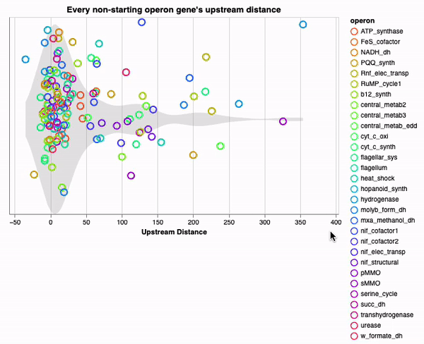

Please enjoy this interactive visualization gallery compiled from various charts made throughout my PhD work! I found it quite valubable to be able to dig in and explore data interactively as I tried to figure out what was going on. Most charts are made in Python using Altair. 

# Visualization gallery
### [PAGE STILL UNDER CONSTRUCTION]

### From Thesis Chapter 3

    <table>
        <tr>
            <td>
                <a href="viz_pages/chapter3_pcooords_top3perc.html" title="Go to interactive visualization" display='inline'>
                    
                    
Top 3% gene expression profiles

                </a>
            </td>
            <td>
                <a href="viz_pages/chapter3_pcooords_top1perc.html" title="Go to interactive visualization" display='inline'>
                    
                    
Top 1% gene expression profiles

                </a>
            </td>
            <td>
                <a href="viz_pages/chapter3_mbur_operon_dist.html" title="Go to interactive visualization" display='inline'>
                    
                    
Intra-operon distances

                </a>
            </td>
        </tr>
        <tr>
            <td>
                <a href="viz_pages/chapter3_tradeoff.html" title="Go to interactive visualization" display='inline'>
                    
                    
Top gene set size vs. expression tradeoff

                </a>
            </td>
            <td>
                <a href="viz_pages/chapter3_consensus_prediction_match.html" title="Go to interactive visualization" display='inline'>
                    
                    
Promoter prediction similarity to consensus motifs

                </a>
            </td>
            <td>
                <a href="viz_pages/chapter3_posIC_vs_enrichment.html" title="Go to interactive visualization" display='inline'>
                    
                    
Motif prediction info content vs enrichment in promoter regions 

                </a>
            </td>
        </tr>
    </table>

### From Thesis Chapter 2

    <table>
        <tr>
            <td>
                <a href="viz_pages/chapter2_PC12_zoom.html" title="Go to interactive visualization" display='inline'>
                    
                    
PCA components 1 and 2

                </a>
            </td>
            <td>
                <a href="viz_pages/chapter2_PC1234.html" title="Go to interactive visualization" display='inline'>
                    
                    
PCA components 1-4

                </a>
            </td>
        </tr>
    </table>

Later stuff
